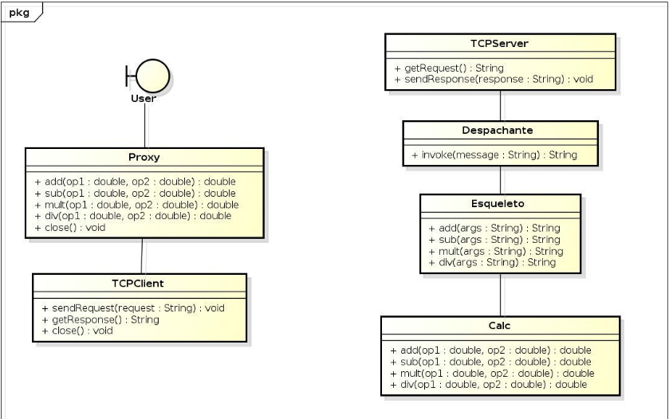

# Evolução da arquitetura Cliente-Servidor

Continuando a evolução da arquitetura Cliente-Servidor vista
no trabalho 1, devemos retirar a interação com o usuário da classe
TCPClient e o serviço da classe TCPServer. Dessa forma, os objetos de
TCPClient e TCPServer tornam-se coesos com o único objetivo de prover
comunicação (estabelecimento de conexão e trocas de mensagens através
dos fluxos de entrada (IN) e saída (OUT)).

Tornar a invocação remota a método transparente para
o usuário.

Requesitos:
    
    User:
        - Objeto de fronteira que implementa a interação com o usuário. Permite que o usuário escolha uma operação, atribua os parâmetros necessários e receba a resposta.

    Proxy: 
        - Tornar a invocação remota a método transparente para o usuário. O objeto de fronteira (User) “acha” que o Proxy é o objeto que realmente fornece o serviço.
        - Empacota a requisição remota (operação + parâmetros) em uma mensagem e solicita o envio via sendRequest(String request) de TCPClient.
        - Recebe a resposta via getResponse de TCPClient, desempacota o resultado e o retorna para User.
    Despachante: 
        - Recebe a requisição, desempacota a operação e invoca o método correspondente do esqueleto.
        - Recebe o retorno do esqueleto e o retorna para o ServidorTCP para ser enviado ao cliente.
    Esqueleto:
        - Semelhante ao Proxy para o lado Servidor.
        - Desempacota os parâmetros, faz as conversões necessárias e chama o método apropriado do serviço (Calc).
        - Recebe a resposta e a empacota para retorná-la ao despachante.
    Objetivo:
        - Realmente implementa as funções da objetivadas.

# Relatório

## 1. Introdução

Para o desenvolvimento deste projeto decidimos criar uma aplicação baseada em
um Tamagotch, na qual foi um brinquedo eletrônico que fez parte da infância de
diversas pessoas. Então, para quem não conheceu, Tamagotch é um bichinho de
estimação eletrônico no qual o usuário poderá fazer interações para cuidar dele.
O Tamagotchi poderá vir a ficar doente e até mesmo morrer caso o usuário seja
irresponsável, Tornando o jogo mais interessante.

## 2. Desenvolvimento

O nosso projeto foi desenvolvido da seguinte forma: Construı́mos um cliente em
Python e um servidor em Java.

### 2.1. Cliente

No nosso cliente (onde o usuário irá interagir com programa) é pedido ao usuário
para que ele coloque um nome no seu bichinho em seguida essa informação e passada para uma função (born()) na qual irá criar um JSON e colocar as
informações de que ele deseja criar um novo Tamagotch e o nome dele, então
este JSON é enviado ao servidor que retorna um JSON contendo todas aQuando
o servidor é iniciado, ele fica aguardando uma requisição do cliente, inicialmente
ele recebe um JSON contendo um pedido para a instanciação de uma Tamagitch
e o seu nome, em seguida essa informação é despachada para as devidas classes
e o objeto é instanciado e “encapsulado” em um JSON e retornado ao cliente,
após a criação, o servidor receberá requisições de interação com o bichinho que
funcionará análogo a criação, recebe um JSON com o Tamagitch, observa qual
a interação desejada processa os dados alterando o objeto e por fim retorna-o
atualizado como um JSON.s informações do Tamagotch e este passa por uma
função que o transforma em um objeto do tipo Tamagotch, a partir desse ponto
é exibido um menu com 7 possibilidades de interação 5 deles incrementando
e decrementando valores do Tamagotch seguindo o mesmo padrão da primeira
função, só que ao invés de apenas o nome, todo o objeto Tamagotch é inserido no
JSON e sempre substituimos o objeto tamagotch que temos salvo na memória
do cliente pelo objeto que recebemos do servidor um nos devolve o status atual
do Tamagotch com o sentimento que ele está sentindo no momento e outro serve
para fechar o nosso cliente e nossa sessão no servidor ( Todas as informações do
tamagotch são perdidas nesse processo ).

### 2.2. Servidor 

Quando o servidor é iniciado, é aguardado uma requisição do cliente, inicial-
mente ele recebe um JSON contendo um pedido para a instanciação de uma
Tamagitch com o nome dado, em seguida essa informação é despachada para
as devidas classes para que o objeto seja criado, depois é representado em um
JSON e retornado ao cliente, após a criação, o servidor receberá requisições de
interação com o bichinho que funcionará análogamente a criação, ou seja, re-
cebe um JSON com o Tamagotch, observa qual a interação desejada, processa
os dados alterando o objeto e retorna-o atualizado como um JSON. Quando
o cliente requisiciona o encerramento da sua sessão, o servidor tenta fechar a
conecxão e logo após fica disponı́vel para futuros clientes.